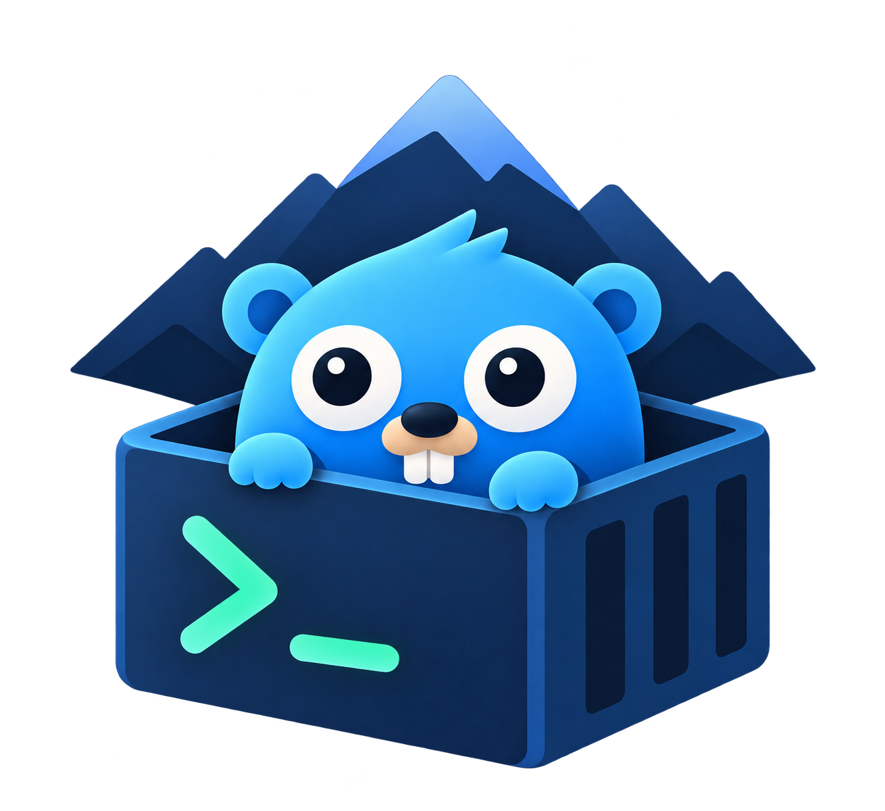
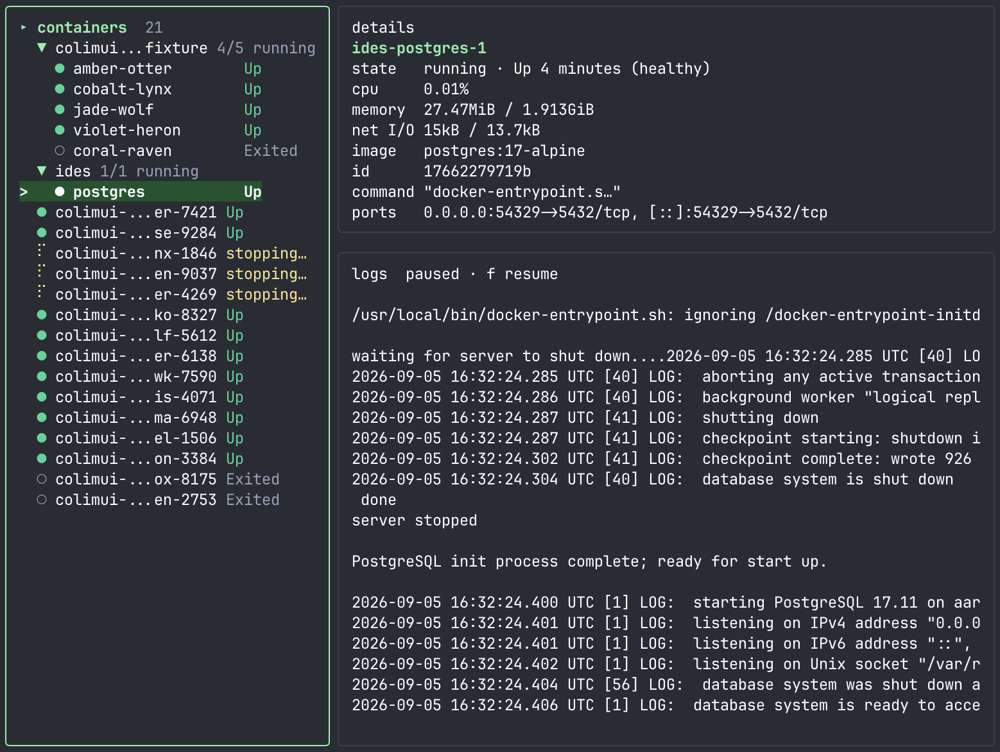

<p align="center">
  
</p>

# colimuir

A lightweight terminal UI for Colima and Docker: a Rust port of
[colimui](https://github.com/leodeim/colimui) with the same screens, keys,
config file and menu bar item. It installs as `colimuir`, so it can sit next to
the Go `colimui`.

<p align="center">
  
</p>

## Build

```sh
cargo install --path .
```

This installs `~/.cargo/bin/colimuir`. Release builds take their version from
`COLIMUI_VERSION` at compile time (`COLIMUI_VERSION=v1.2.3 cargo build --release`);
without it the version is `dev`.

### Run

```sh
colimuir
```

### Update

```sh
colimuir update
```

`update` reads the latest `leodeim/colimui` release and installs it only when
that release carries a `colimuir_<os>_<arch>` build and `checksums.txt`; Go-only
releases are ignored, so it never replaces itself with the Go binary.

## Keys

| Key | Action |
| --- | --- |
| `?` | Open or close the Actions menu |
| `u` | Open/close Docker usage overview: total CPU, RAM, and storage |
| `c` | Open cleanup confirmation for reclaimable Docker storage |
| `Tab`, `←`, `→` | Switch focus between containers and logs |
| `Enter` | Start/stop the selected container |
| `/` | Search containers |
| `R` | Toggle running containers only |
| `r` | Refresh profiles and containers |
| `[` / `]` | Switch to the previous/next Colima profile |
| `s` / `x` | Start/stop the current Colima profile |
| `a` | Enable/disable idle auto-stop (saved for future runs) |
| `m` | Enable/disable the macOS menu bar item (saved for future runs) |
| `t` | Restart the selected container |
| `e` | Open an interactive shell in the selected container |
| `d` | Open deletion confirmation for a stopped container |
| `y` / `n` | Confirm/cancel deletion |
| `y` | Copy the selected container's details to the clipboard |
| `Y` | Copy the visible (filtered) logs to the clipboard |
| `l` | Reload the selected container's logs |
| `f` | Pause streaming without clearing logs, or resume from the latest 200 lines |
| `L` | Search retained log text (pauses streaming) |
| `T` | Show/hide Docker timestamps |
| `w` | Wrap/trim long log lines |
| `Home` | Load log history from the start, subject to retention limits |
| `Page Up` / `Down` | Scroll logs |
| `End` | Jump to the latest logs |
| `q` | Quit, or close the current menu |

## Idle auto-stop

When the current profile has had no active containers (running, restarting, or paused)
for 30 minutes, it runs `colima stop` for you. The header shows a countdown ("idle · auto-stop in
12m") once the timer is armed; press `a` to turn the feature off or back on.

Set `COLIMUI_AUTO_STOP` to override the saved setting for a single run: a
duration such as `45m` or `2h` (minimum `1m`), or `off` to disable it. While
it is set, `a` is disabled.

While the macOS menu bar item is running it takes over enforcement: it watches
every profile (not just the selected one), keeps working after the TUI exits,
and shows the countdown in each profile's submenu. A menu bar item started
from the TUI follows the saved setting, not `COLIMUI_AUTO_STOP`.

Settings live in `$XDG_CONFIG_HOME/colimui/config.json` (default
`~/.config/colimui/config.json`), shared with the Go `colimui` in the same
format. The menu bar lock (`menubar.pid` beside it) is shared too, so only one
menu bar item runs and enforces auto-stop, whichever tool started it. The
`COLIMUI_AUTO_STOP` and `COLIMUI_NO_COLOR` variables apply to both tools.

## Differences from the Go version

- `colima list --json` prints one object per line when several profiles exist;
  this port parses that (and arrays), where the Go version fails to list profiles.
- `COLIMUI_NO_COLOR=1` turns colors off entirely, as documented; the Go version
  fell back to the terminal's detected color profile.
- Menu bar items have no per-item hover tooltips (the tray icon's "colima"
  tooltip remains); the menu library does not support them.

## Development

```sh
make test   # unit tests
make lint   # rustfmt and clippy
make dev    # rebuild and rerun on change (needs cargo-watch)
```

`cargo run --example gen_menubar_icon` regenerates `assets/menubar-template.png`.
